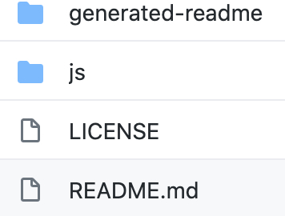
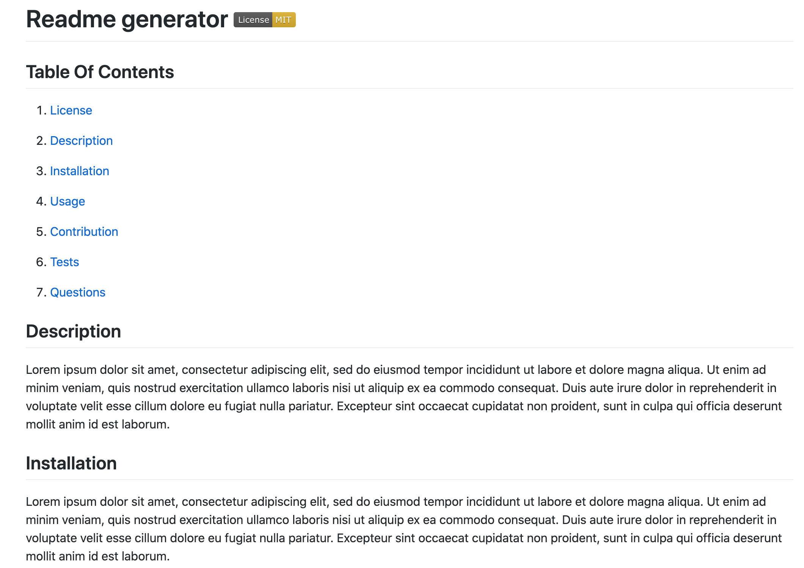

# Readme generator [](https://opensource.org/licenses/MIT)

## Table Of Contents

1. [License](#license)

2. [Description](#description)

3. [Installation](#installation)

4. [Usage](#usage)

5. [Questions](#questions)

## Description

Readme generator application consists of two folders. First folder name is js, and it contains inquirer modules plus code that is written by me can be found in the index.js. Second folder is generated-readme, so there can be found the generated README file after the application was run.

Example of folder structure is bellow:



Example of generated README file is bellow:



## Installation

To install the application run the command bellow in your bash/terminal:

```bash
git clone git@github.com:paveldarii/README-generator.git
```

After you downloaded the whole folder on your computer. Open terminal/bash, then enter to the js folder directory. Then, run the next command there:

```bash
npm instal inquirer
```

## Usage

After installation of the application, run the index.js file in the terminal/bash by using command:

```bash
node index.js
```

Make sure that you are in js folder directory.

After you run the index.js file, you should get several questions regarding what needs to be inserted in the readme file, so after you answered all the questions, automatically will be generated a README file in the generated-readme folder.

[YouTube readme generator usage demo](https://www.youtube.com/watch?v=Hj7nX4s07zA&t=1s)

## Questions

My GitHub profile: [https://github.com/paveldarii](https://github.com/paveldarii).

My email address: paveldarii@yahoo.com

## License

[The MIT License](https://opensource.org/licenses/MIT/)
